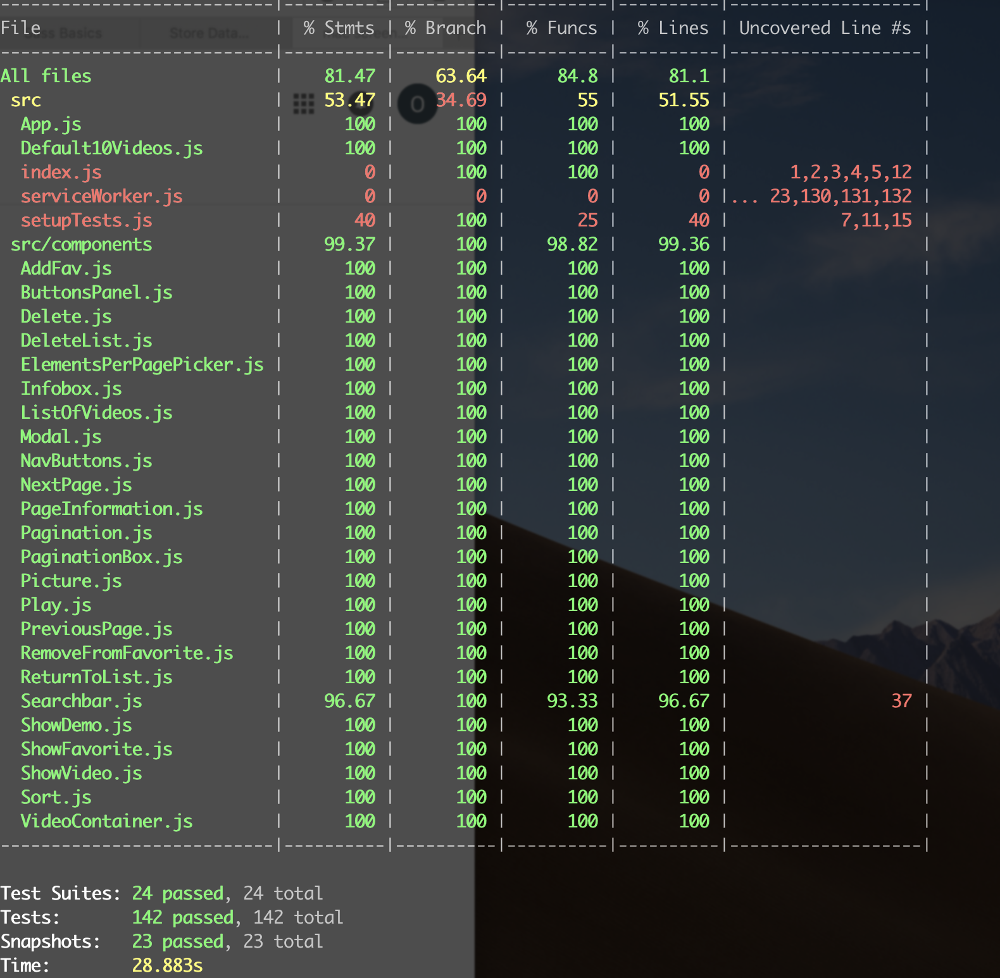

# Favourite video
Deployed to https://elegant-kare-dfa9c6.netlify.com
Responsive SPA in JS/React that allows user to add videos from YouTube using link/ID (integration with YT API), to mark favourite videos (stored in LocalStorage) and play the video using player modal overlay window. Video grid allows pagination, setting number of elements on page, sort by date added and filter by favourite.

Project has been tested with Jest and Enzyme.

This project was bootstrapped with [Create React App](https://github.com/facebook/create-react-app).

## How to run?
1. clone this repository
2. cd to the application folder
3. install dependencies with `npm install`
4. start server with `npm start`
5. new browser window will open automatically

### How to test?
1. `npm test`
Launches the test runner in the interactive watch mode. 
2. `npm test -- --coverage`
Runs all tests and show test coverage

## Built with
HTML, CSS, JavaScript, ReactJS

## Dependencies
 -  YouTube Data API: https://developers.google.com/youtube/v3/docs/
 - 'react-youtube' library: https://www.npmjs.com/package/react-youtube
